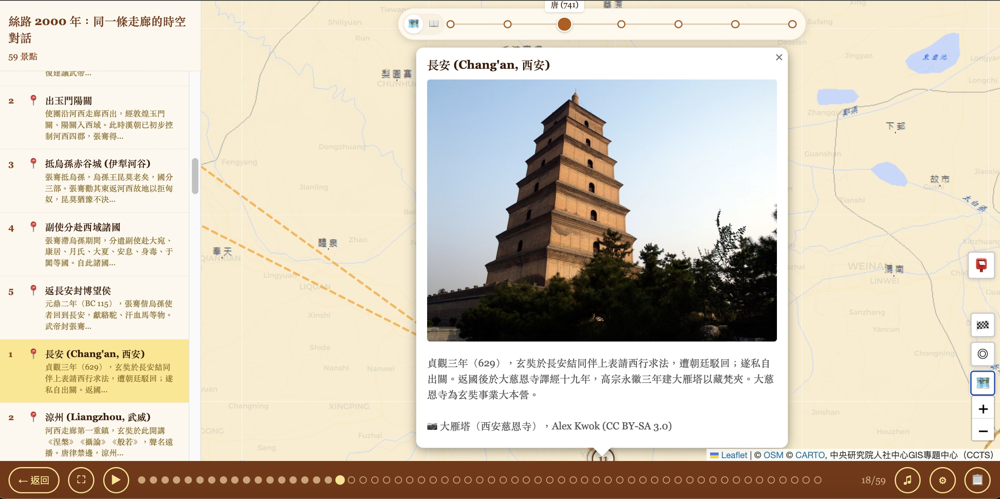
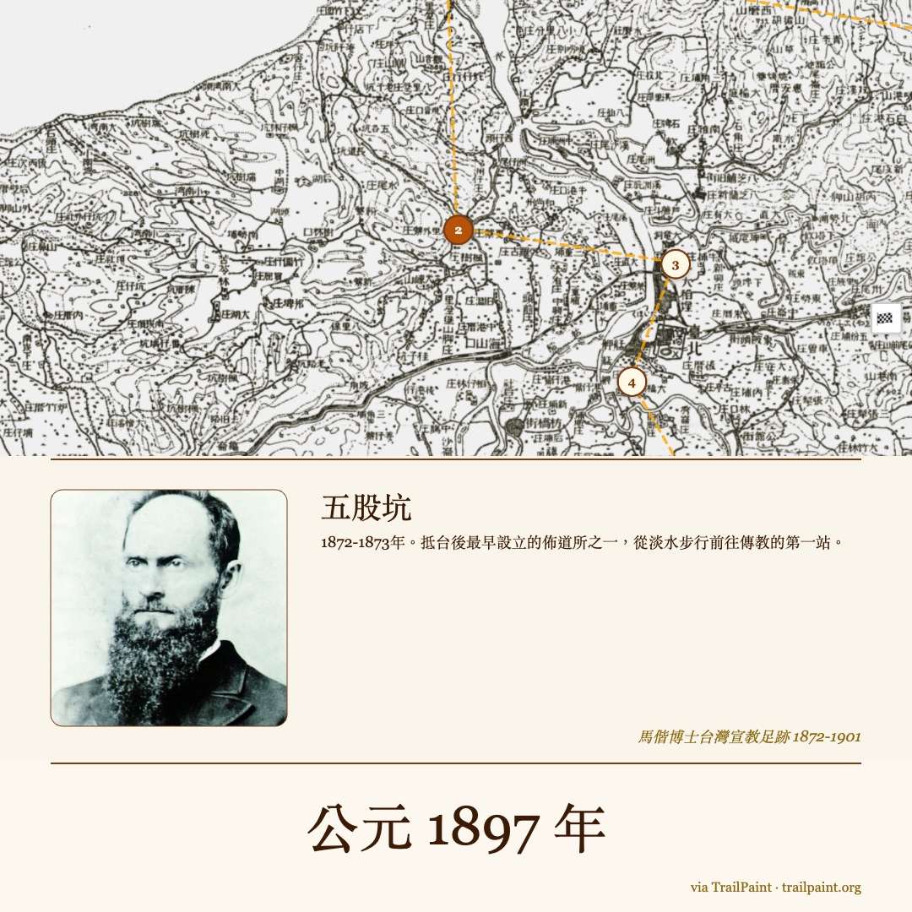

# TrailPaint

[中文](README.md) | [日本語](README.ja.md)

> **Hand-drawn style trail map maker** · Turn your trip into a map in minutes · Zero backend, PWA-ready, auto-detects 3 languages

[](https://trailpaint.org/app/)
[](LICENSE)
[](https://www.typescriptlang.org/)
[](https://trailpaint.org/app/)
[](https://trailpaint.org/app/)
[](https://star-history.com/#notoriouslab/trailpaint&Date)

**[Try it now →](https://trailpaint.org/app/)** · **[Explore Stories →](https://trailpaint.org/stories/)** · **[Story Player →](https://trailpaint.org/app/player/)** · **[PWA Install →](https://trailpaint.org/features/install/)**


---

## Positioning

TrailPaint turns "remembering a trip" into "map in 3 minutes → share instantly". Whether you're hiking, traveling, teaching, or missionary work — if you have a story, locations, and photos — TrailPaint generates an illustrated map.

**Core strengths:**

| Strength | Implementation |
|----------|-----------------|
| 📷 **Auto photo import** | EXIF GPS reads coordinates, KML / GeoJSON / GPX supported |
| 🖼️ **Multiple outputs** | PNG (IG/blogs) / backup file / interop formats |
| ⏱ **Spacetime narrative** | Timeline slider + historical maps + auto-guided stories |
| 🔐 **Privacy-first** | Zero backend, all data in browser, works offline |
| 📱 **Install-to-home** | PWA, one-click phone home screen install |


---

## Quick Start (3 ways)

### Option 1: Play instantly (1 minute)

1. Open [trailpaint.org/app/](https://trailpaint.org/app/)
2. Click the menu "Load Sample", pick a route (Yangmingshan, Hehuanshan, Taipei heritage, etc.)
3. Click "Export" → "Image", choose style, download PNG

**Output:** IG-ready illustrated map

### Option 2: Hand-draw (5 minutes)

1. Open editor, search location or drag screenshot for custom basemap
2. Click "Add Spot" to place markers, drag to draw route
3. Click "Export" to pick style and download

**Output:** Custom map or shareable short URL

### Option 3: Import existing (1 minute)

1. Prepare GPX (hiking app), KML (Google My Maps), or photo folder
2. Click "Import" → drag or select file
3. System auto-creates spots → click "Export"

**Output:** Auto-generated map

---

## Common Use Paths

| Scenario | Steps | Output |
|----------|-------|--------|
| 🎒 **Hikers** | Record GPX → import → tag spots → elevation profile | Route file (share with team) |
| 📸 **Travel bloggers** | Shoot 20 photos (with EXIF GPS) → drag into TrailPaint → add captions | IG Story / 9:16 long-form image |
| ⛪ **Churches / teaching** | Load "Missionary Footprints" or "Passion Week" → Story Player with timeline + historical maps → present | Projection / lesson embed |
| 🌲 **Ecology guides** | Hand-tag spots + upload species photos → add descriptions → export KML to Google My Maps | Navigation map file |
| 🎨 **Storytellers** | Create fictional route → use AI prompt to stylize → embed in blog | Notion / WordPress iframe |

---

## Core Concepts

### Building trails: Three channels

#### 📷 Auto from photos (1 minute)
Shoot 20 photos with EXIF GPS → drag into TrailPaint → auto-extract coordinates & spot names. Supports iPhone HEIC / Android JPEG, reverse geocoding, drag-to-place for photos without GPS.

#### 🗺️ Hand-draw on map (classic flow)
Search location → click "Add Spot" to place markers → fill name & photos → click "Draw Route" → export. First-time guided tour included; also one-click load 8 sample routes.

#### 🤖 AI-generated
Click "Import" → "Create trail JSON with AI" → copy prompt template, paste to ChatGPT / Claude → AI generates importable JSON. Great for planning or fictional creation.

**Import formats:** GPX (hiking apps), KML (Google My Maps), GeoJSON (geojson.io), .trailpaint files, screenshots as basemaps


---

### Outputs: One map, many products

#### 🖼️ Image export (for sharing)

**PNG ratios:** 1:1 (IG feed) / 9:16 (Story) / 4:3 / original

**Borders + filters:** 3 border styles (classic double / paper sketch / minimal thin) × 2 filters (original / sketch)

**Share & embed:**
- 🔗 Short URL (Cloudflare Workers + KV, 90-day TTL, auto-OG cover from first photo)
- 📋 iframe embed code — paste to WordPress, Notion, Substack, etc.


#### 💾 Backup file (for editing)

Download .trailpaint project (preserves all spots, routes, photos, edit state) → import later when switching devices or reinstalling.

#### 🌐 Interop (for other tools)

- **GeoJSON**: geojson.io, Mapbox, D3 visualizations
- **KML**: Google My Maps, Google Earth, Gaia GPS

Pure geographic data, no photos.

---

### Story Player: Maps that tell stories

**[Story Player](/app/player/)** is a standalone playback entry that transforms static maps into auto-guided experiences:

#### Core playback features

| Feature | Purpose |
|---------|---------|
| ▶ **Fly-to animation** | Fly to each spot, popup shows photo and description |
| ⚙ **Playback settings** | Interval 2s/4s/6s/8s, loop 1×/2×/3×/∞ |
| 🗺️ **Basemap + historical layers** | 5 basemaps + Academia Sinica (Han/Tang/Song/Yuan/Ming) + Taiwan 1897/1921/1966 + AD 200 Rome |
| 🎵 **Background music** | Paste MP3/M4A direct URL to play |
| 📺 **Fullscreen mode** | Optimized for exhibits, classroom projection, event displays |

#### Featured story maps (v1.4 new)

- **Taiwan Missionaries' Footprints**: 19-20th century missionary routes + Academia Sinica historical overlays
- **Passion Week**: 12+ biblical locations + classical paintings + YouVersion scripture links
- **Paul's Three Missionary Journeys**: 34 spots, AD 46-62 Mediterranean and Rome
- **Silk Road 2000**: Zhang Qian BC 138 → Xuanzang AD 629 → Marco Polo AD 1271, same Central Asian corridor


#### ⏱ Timeline slider (TimeSlider)

Horizontal slider at map top: drag to auto cross-fade historical map layers and fade non-era spots. Toggle between "Historical Maps" or "Biblical Timeline" scales.

#### 📚 Compilation

Bundle multiple story segments into one Player:
- `sequential`: play in story order
- `chronological`: global timeline sort (cross-character mix)

Three defaults: Paul's three journeys / Four Gospels map / Silk Road 2000.



#### 📮 IG-square postcard

One-click generate 1080×1080 PNG per spot:
- Top half: map (auto-zoom to see historical map texture)
- Middle: spot card (photo + title + scripture + description)
- Bottom: era stamp ("AD 1897" / "AD 50" / "BC 138") + watermark

Smart fallback: if spot not in current geographic range, auto-switch to modern basemap.



#### ⛪ Church landing page (`/church/`)

Pre-built examples: Sunday school Four Gospels / bulletin Paul's three / daily devotional Silk Road 2000. One-click copy iframe embed code.

---

### AI stylization

Export PNG → copy AI prompt → feed to ChatGPT / Gemini image generation for true hand-drawn illustration.

4 preset prompt styles: Japanese hand-drawn / Treasure map / Kawaii cartoon / Minimalist line art.


---

---

## Advanced Reference

### Complete feature matrix

| Category | Features |
|----------|----------|
| **Basemap & markers** | 5 online maps (standard / satellite / contour / dark / multilingual vector) · drag screenshot for custom basemap · 31 spot icons · hand-drawn dashed lines + arrows · paper-texture spot cards |
| **Data handling** | GPX / KML / GeoJSON import (auto-simplified) · Photo EXIF GPS (iPhone HEIC / Android JPEG) · Elevation profile (distance/time/cumulative gain-loss) · Reverse geocoding auto-name |
| **Edit & interact** | Undo/Redo (Cmd+Z) · Drag-edit nodes · Spot reordering · Hand-drawn shake SVG filter · Fit All overview |
| **Export & share** | PNG multi-ratio crop · 3 borders + 2 filters · Short URL (auto-OG from photo) · Player iframe · GeoJSON / KML pure geographic · .trailpaint full backup |
| **Experience polish** | PWA installable · Auto-detect 3 languages · Mobile floating menu · Guided tutorial · 8 sample routes |

### External services

| Service | Purpose | Link |
|---------|---------|------|
| Leaflet | Map engine | [leafletjs.com](https://leafletjs.com) |
| OpenStreetMap | Map data (local-language labels) | [openstreetmap.org](https://www.openstreetmap.org) |
| Protomaps | Multilingual vector tiles | [protomaps.com](https://protomaps.com) |
| CARTO | Map tiles | [carto.com](https://carto.com) |
| Photon | Place search + reverse geocoding (primary) | [photon.komoot.io](https://photon.komoot.io) |
| Nominatim | Reverse geocoding (fallback) | [nominatim.org](https://nominatim.openstreetmap.org) |
| Open-Meteo | Elevation data | [open-meteo.com](https://open-meteo.com) |
| Cloudflare Workers + KV | Share-link short URLs (90-day TTL) | [workers.cloudflare.com](https://workers.cloudflare.com) |
| Academia Sinica | Taiwan historical maps 1897/1921/1966 | [gis.sinica.edu.tw](https://gis.sinica.edu.tw) |

---

## Ecosystem & Integration

### Website entry points

| Page | Purpose |
|------|---------|
| [`/app/`](https://trailpaint.org/app/) | **Editor** — main authoring interface (new, import, hand-draw) |
| [`/app/player/`](https://trailpaint.org/app/player/) | **Story Player** — auto-guided playback (timeline slider, compilations, music) |
| [`/stories/`](https://trailpaint.org/stories/) | Curated story collections (Taiwan missionaries, Passion Week, Paul's journeys, Silk Road 2000, etc.) |
| [`/examples/`](https://trailpaint.org/examples/) | Sample trails (one-click play) |
| [`/features/`](https://trailpaint.org/features/) | Feature walkthrough (import / export / Story Player / AI prompt) |
| [`/features/install/`](https://trailpaint.org/features/install/) | PWA install guide (iOS / Android / desktop) |
| [`/church/`](https://trailpaint.org/church/) | Church landing page (Sunday school, bulletin, devotional embed examples) |
| [`/faq/`](https://trailpaint.org/faq/) | Frequently asked questions |
| [`llms.txt`](https://trailpaint.org/llms.txt) / [`agent-card.json`](https://trailpaint.org/.well-known/agent-card.json) | Structured summaries for AI and agents |

### Relationship to notoriouslab ecosystem

- **doc-cleaner**: PDF/PPTX/Word cleanup → output can become trail map spot descriptions
- **OpenSpec**: Specification management (TrailPaint's Spectra SDD specs live here)
- **bu-ketao**: Chinese LLM output compression (trail story descriptions can use these rules)

---

## Technical Details

### Core tech stack

| Layer | Technology |
|-------|------------|
| **Frontend** | Vite + React 19 + TypeScript 5 (strict mode) |
| **Map engine** | Leaflet + react-leaflet + protomaps-leaflet (vector tiles) |
| **State management** | Zustand + zundo (temporal undo/redo) |
| **PWA** | vite-plugin-pwa + Workbox (offline support) |
| **Export** | html-to-image + Canvas post-processing + SVG style filters |
| **Import** | exifr (EXIF GPS) + @tmcw/togeojson (KML) + custom GeoJSON parser |
| **i18n** | Custom t() function + runtime locale detection |
| **Architecture** | `core/` (logic, no Leaflet deps) · `map/` (Leaflet integration layer) · `player/` (standalone entry) |

### Build & deployment

- **Editor + Player**: Vite rollup multi-entry (`/app/` + `/app/player/`)
- **Story Page**: Pure static HTML + vanilla JS (native SEO/OG, bypasses Vite)
- **Cloudflare Worker**: Short-URL share links (KV storage, 90-day TTL)

---

## Development & Contributing

### Quick start

```bash
cd online
npm install
npm run dev        # Dev server (:5173)
npm run build      # Build to ../app/
npm test           # vitest
```

**Cloudflare Worker** code: [`cloudflare/`](./cloudflare/) directory, deployment instructions in that README.

**Spectra SDD specs**: `openspec/changes/` (local dev reference, not in git)

---

## Share Your Work

Made a trail map you're proud of? Share your `.trailpaint` project file via [GitHub Issue](https://github.com/notoriouslab/trailpaint/issues) with an exported image and the story (which trail? why did you walk it?).

Outstanding maps will be featured on [`/stories/`](https://trailpaint.org/stories/) for the community to discover.

---

## Contributing

We welcome:
- 🐛 Bug reports (with reproduction steps, screenshots)
- 💡 Feature requests (new export formats, new basemaps, new story themes)
- 🎨 Map sharing (see "Share Your Work" above)
- 📝 Documentation improvements
- 🔧 Code PRs

---

## Disclaimer

TrailPaint is a **trail recording and sharing tool, not a navigation app**.

- Distance, time, and elevation data are auto-calculated from maps and GPX tracks and may differ from reality
- Plan outdoor activities independently and follow on-site conditions
- Basemap data comes from OpenStreetMap / CARTO and other third-party services with no real-time or accuracy guarantees

---

## License

**GPL-3.0 License** — free to use, modify, and create derivatives. Derivative works must also be GPL-3.0 open source.

See [LICENSE](LICENSE) for details.

---

[](https://star-history.com/#notoriouslab/trailpaint&Date)

---

*TrailPaint's prototype was inspired by Taipei Bread of Life Church Zhi Fu Yi Ren Academy's Park Ecology Exploration program and professional outdoor ecology guiding needs. 🌿*
